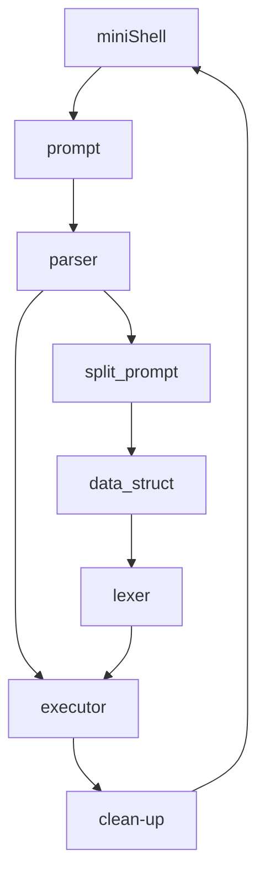
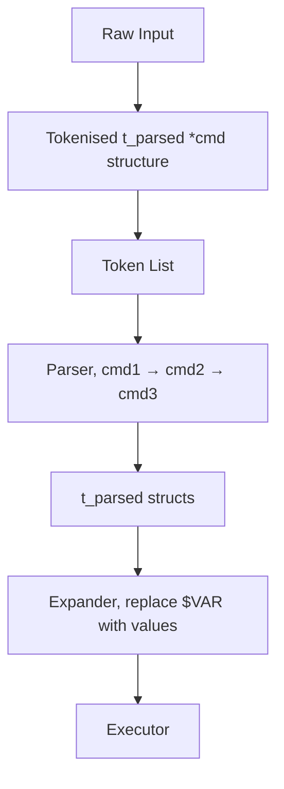

# Docs for architecture and structure

## The general structure (to be cleared on the way)
Functional structure of a shell is pretty straight forward: it [parses  arguments](#structure-of-parsing), transfers [execution of a program](#execution) to the OS or executes it by itself (for inbuilt programs) and cleans up memory after each command execution.

As a somewhat parallel flow of code is signal handling. It has to either terminate command execution and clean up after it, or quit the mini-shell program cleanly.


### structure of parsing

### Execution
Execution has two modes: interactive (normal) and one-shot excution mode. The one-shot mode is added for compatibility with testers. Normal mode execution is represented below.

```mermaid
graph TD;
	T[token]-->IR[detect redirection and redirect STDIN/STDOUT]
	IR-->I[inbuilt direct execution]
	I-->CLEAN[clean up memory]

	T-->SE[side binary execution]
	SE-->PF[find full path]
	PF-->F[fork and execute in child (execve)]
	SE-->FPC[full path command provided]
	FPC-->F
	F-->FR[detect redirection and redirect STDIN/STDOUT]
	FR-->CLEAN
	CLEAN-->RETURN[return to waiting mode]


```

suggested main structure
```
while (1)
{
    setup_signals();
    input = read_input();
    if (input == NULL) // ctrl+D
        exit_gracefully();
    tokens = tokenize(input);
    cmd_tree = parse(tokens);
    execute(cmd_tree);
    clean_up(cmd_tree, tokens, input);
}
```

## The project structure ()
I generally do not like the structure of the `input/` folder
```
minishell/
├── src/
│   ├── main.c                         # Entry point, shell loop, prompt setup
│   ├── input/                         # Reading user input
│   │   ├── prompt.c                   # Show prompt, readline wrapper
│   │   ├── history.c                  # Custom history or readline integration
│   │   └── signals.c                  # Signal setup and handling
│   ├── lexer/                         # Tokenization (including quotes, $, meta chars)
│   │   ├── tokenize.c
│   │   ├── quote_handling.c
│   │   ├── env_expansion.c
│   │   └── lexer_utils.c
│   ├── parser/                        # Parsing command trees
│   │   ├── parse.c
│   │   ├── parse_cmd.c                # Command + args
│   │   ├── parse_redirects.c          # > >> < <<
│   │   ├── parse_pipe.c               # | handling
│   │   └── parser_utils.c
│   ├── executor/                      # Exec logic, fork/execve, pipes
│   │   ├── executor.c
│   │   ├── exec_cmd.c
│   │   ├── exec_pipe.c
│   │   ├── exec_redirects.c
│   │   └── exec_utils.c
│   ├── builtin/                       # Builtin implementations
│   │   ├── echo.c
│   │   ├── cd.c
│   │   ├── pwd.c
│   │   ├── export.c
│   │   ├── unset.c
│   │   ├── env.c
│   │   └── exit.c
│   ├── env/                           # Env list handling and lookup
│   │   ├── env_init.c
│   │   ├── env_getset.c
│   │   ├── env_utils.c
│   ├── utils/                         # General helpers
│   │   ├── str_utils.c
│   │   ├── mem_utils.c
│   │   ├── error.c
│   │   └── debug.c (optional)
├── include/
│   ├── minishell.h                    # Core types and includes
│   ├── lexer.h
│   ├── parser.h
│   ├── executor.h
│   ├── builtin.h
│   ├── env.h
│   ├── signals.h
│   ├── prompt.h
│   └── utils.h
├── libft/                             # Your custom lib (if allowed)
├── Makefile (edited) 
```
